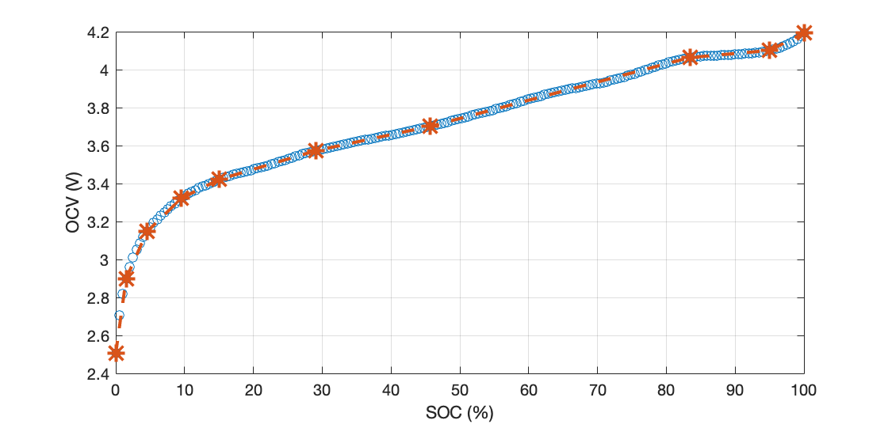
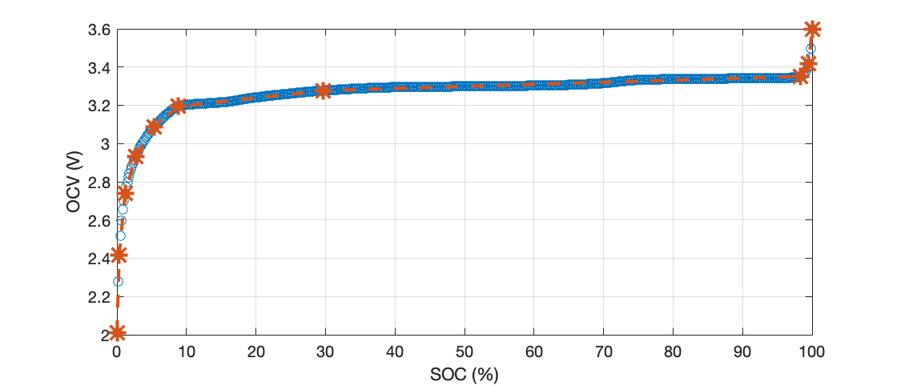

# Piecewise Linear Approximation of Battery Open-Circuit Voltage Characteristics Using Dynamic Programming
This demo loads C/32 pseudo-OCV data collected from two commercial Lithium-ion cells (Molicel INR-21700-P42A and Lithium Werks APR-18650-M1B). It implements a dynamic programming approach to reduce (or nonuniformly downsample) the $N$-dimensional (pseudo) OCV-SOC data to $M$-dimensional OCV-SOC breakpoints, where $M < N$. 

In the figures below, blue circles represent the OCV-SOC data points, and orange asterisks indicate the OCV-SOC breakpoints computed using dynamic programming. The dotted lines show the piecewise linear segments obtained through interpolating between the breakpoints.

### Molicel INR-21700-P42A

### Lithium Werks APR-18650-M1B


### Bibtex:
```
@article{sunil2025piecewise,
  title={Piecewise Linear Approximation of Battery Open-Circuit Voltage Characteristics Using Dynamic Programming},
  author={Sunil, Sooraj and Pattipati, Krishna R and Balasingam, Balakumar},
  journal={IEEE Transactions on Instrumentation and Measurement},
  year={2025},
  publisher={IEEE}
}
